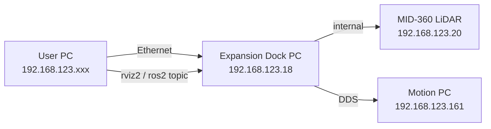
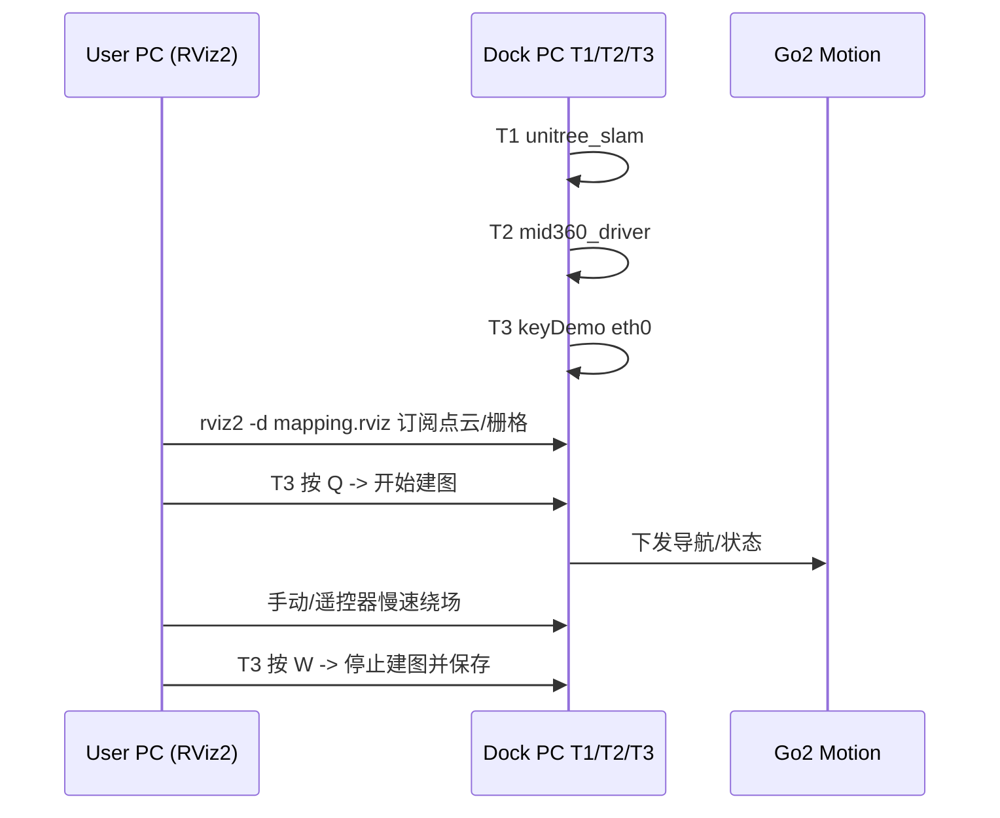

## sudo ./unitree_slam 背景与前置条件

按宇树[SLAM 与导航服务接口](https://support.unitree.com/home/zh/developer/SLAM%20and%20Navigation_service)与 [Weston Robot Go2 SLAM 教程](https://docs.westonrobot.com/software/slam/go2_slam/)的要求：

- 机器狗：Go2 EDU + 扩展坞 PC（板载 Ubuntu，用户 `unitree` / 密码 `123`，IP `192.168.123.18`）
- 雷达：Livox MID-360（IP `192.168.123.20`）
- 运动控制 PC：`192.168.123.161`
- 用户 PC：Ubuntu 20.04/22.04，ROS2 Foxy 或 Humble（SLAM 服务本身跑在狗上的 ROS2-foxy 环境，和 PC 端 ROS 版本无强绑定，RViz2 看图时 PC 需装 ROS2 + Cyclone DDS）

当前工程 [unitree_sdk2](README.md) 里并没有现成的 `SlamClient`/`NavigationClient`，所以"方式 A（keyDemo 路径）"完全不需要改这个仓库里的代码，也不需要先编译它。这个仓库将来要用 C++ 调 `slam_operate` 服务（API 1801/1802/1804/1102/1201/1901）时才会用到，本次测试可跳过。

## 拓扑与流程总览







## 步骤 1：用户 PC 网络配置

- 用网线接到 Go2 扩展坞网口。
- 把本机有线网卡 IPv4 设成静态：`192.168.123.222/24`（任意 `.2~.254` 且不与 `.18/.20/.161` 冲突），网关留空。
- 验证连通：
  - `ping 192.168.123.18`（扩展坞）
  - `ping 192.168.123.20`（MID-360）
  - `ping 192.168.123.161`（运动控制 PC）

## 步骤 2：SSH 登录扩展坞并完成一次性配置

- `ssh unitree@192.168.123.18`（密码 `123`），出现 ROS 版本选择时选 `1`（ROS2-foxy）。
- 调大 DDS 接收缓冲（只需做一次）：

```bash
  sudo su
  echo "net.core.rmem_max=52428800" >> /etc/sysctl.conf
  echo "net.core.wmem_max=52428800" >> /etc/sysctl.conf
  sysctl -p
  exit
  sudo chmod 777 -R /unitree/module/unitree_slam
  

```

- 检查 cyclonedds 配置是否匹配扩展坞上实际网卡名（一般是 `eth0`）：

```bash
  cat /home/unitree/cyclonedds_ws/cyclonedds.xml | grep -i NetworkInterface
  ip -br link
  

```

## 步骤 3：确认 MID-360 参数

在扩展坞上确认激光雷达选用的是 MID-360：

```bash
cd /unitree/module/unitree_slam/config/slam_interfaces_server_config
sudo vim param.yaml       # 保留 mid360 相关行，注释掉 xt16 相关行
cd /unitree/module/unitree_slam/config/gridmap_config
sudo vim config.yaml      # 一般无需改动，先过一遍
```

## 步骤 4：在扩展坞上起 SLAM 服务（开三个 SSH 终端）

三个终端都执行 `ssh unitree@192.168.123.18` 并在提示时选 `1`。

- 终端 T1 —— SLAM 主服务：

```bash
  cd /unitree/module/unitree_slam/bin
  sudo ./unitree_slam
  

```

- 终端 T2 —— MID-360 驱动：

```bash
  cd /unitree/module/unitree_slam/bin
  sudo ./mid360_driver
  

```

- 终端 T3 —— 按键交互 Demo：

```bash
  cd /unitree/module/unitree_slam/bin
  sudo ./keyDemo eth0        # 参数是扩展坞上的网卡名
  

```

  T3 打印按键菜单后再做下一步。

启动后可用的 DDS 话题（在 PC 端 `ros2 topic list` 能看到）：

- `rt/unitree/slam_mapping/points`（实时点云）
- `rt/unitree/slam_mapping/odom`（里程计）
- `rt/slam_info`（服务广播）
- `rt/slam_key_info`（状态反馈）

## 步骤 5：在用户 PC 起 RViz2 实时观察（可选但强烈推荐）

前提：PC 已按[ROS2 Services Interface](https://support.unitree.com/home/zh/developer/ROS2_service)安装好 `unitree_ros2` 并使用 Cyclone DDS。

```bash
export ROS_DOMAIN_ID=0
source ~/unitree_ros2/setup.sh
scp -r unitree@192.168.123.18:/unitree/module/unitree_slam/rviz2 ./slam_rviz2
cd ./slam_rviz2
rviz2 -d mapping.rviz
```

如果不想装 ROS2，也可以先跳过 RViz，只靠 T3 的终端反馈和机器狗表现判断是否在建图。

## 步骤 6：用 keyDemo 完整测一遍 SLAM

在 T3 里按键，机器狗会收到导航/建图指令。关键按键：

- `Q`：开始建图。开始前确保狗站立在"起点位姿"（这个点将作为后续定位/导航的原点）。
- 用遥控器或 `go2_sport_client` 让狗以 <0.5 m/s 慢速把场景绕 1~2 圈（避开尖锐转弯、避开低于 20 cm 的矮障碍物；关机自带避障，让头灯变蓝）。
- `W`：停止建图，地图会按配置保存为 `.pcd`（默认 `/home/unitree/...`，具体路径看 T1 日志）。
- 把狗搬/走回起点位姿。
- 触发重定位/定位（keyDemo 菜单里对应键；通常是载入刚保存的 pcd 并在当前位姿附近做 ICP 匹配），在 RViz 里确认点云对齐。
- 导航测试：选目标点（距离必须 < 10 m，节点间距建议 > 1.5 m），观察狗走直线到达；`Z` 键随时暂停导航，`Ctrl+C` 结束三个终端即可退出服务。

验收标准：

- T1 日志持续刷新里程计和帧处理耗时；
- RViz 里 `rt/unitree/slam_mapping/points` 点云稳定、地图闭合；
- `W` 后 `.pcd` 能正常落盘；
- 载入地图后导航目标点在 1 m 精度内到达。

## 步骤 7（可选）：后续切到 SDK 方式

只要 A 跑通，后面想用本仓库 C++ 直接调服务时，只需在 `example/go2/` 下按 [include/unitree/robot/go2/obstacles_avoid/obstacles_avoid_client.hpp](include/unitree/robot/go2/obstacles_avoid/obstacles_avoid_client.hpp) 的模式新增一个 `SlamClient`，`SERVICE_NAME="slam_operate"`，`API_VERSION="1.0.0.1"`，然后通过基类 [Client::Call](include/unitree/robot/client/client.hpp)（`Call(apiId, parameter, data)`）按下列 JSON 发起调用：

- `1801` 起始建图：`{"data":{"slam_type":"indoor"}}`
- `1802` 结束建图：`{"data":{"address":"/home/unitree/test.pcd"}}`
- `1804` 初始化位姿：`{"data":{"x":0,"y":0,"z":0,"q_x":0,"q_y":0,"q_z":0,"q_w":1,"address":"/home/unitree/test.pcd"}}`
- `1102` 位姿导航：`{"data":{"targetPose":{"x":2,"y":0,"z":0,"q_x":0,"q_y":0,"q_z":0,"q_w":1},"mode":1,"speed":0.5}}`（mode: 1 避障停止 / 0 绕行；speed 0.2~1.0）
- `1201` 暂停导航 / `1901` 关闭 SLAM：`{"data":{}}`

这一步本次先不做，等 A 验证完硬件链路再说。

## 常见坑位速查

- `ping 192.168.123.20` 不通：雷达未上电或扩展坞内部网段异常，先重启扩展坞。
- T1 起不来报缓冲区不足：说明步骤 2 里 rmem/wmem 没生效，重新 `sysctl -p` 或重启。
- PC 上 `ros2 topic list` 看不到 `rt/unitree/...`：Cyclone DDS 没启用，或 `ROS_DOMAIN_ID` 不等于 0，或 PC 和扩展坞网段不通。
- `./keyDemo eth0` 报网卡错：用 `ip -br link` 确认扩展坞网卡名，必要时换成 `ens33` 等。
- 导航不走或跑飞：起点位姿没对齐或目标点 > 10 m，回到起点重新初始化位姿。

