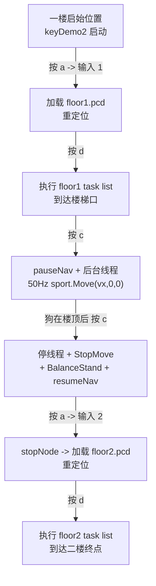

# Go2 EDU 分层建图 + 爬楼导航方案

## 先回答你问的"在起点还是终点按 a 更准"

看现在的代码 [unitree_slam/example/src/keyDemo.cpp](unitree_slam/example/src/keyDemo.cpp) 第 276-295 行，`relocationPlFun()` 把 ICP 初值硬编码成 `(x=0, y=0, z=0, q_w=1)`——这就是**建图起点**。

所以：

- **当前代码必须回到建图起点按 a** 才能稳定重定位。你之前在终点按 a 收到 `errorCode: 509 ICP low` 就是因为初值偏太远。
- **工程上最省事的做法**：每张地图都从"演示起点"开始建。即
  - `floor1.pcd`：从一楼演示启始位置按 q 开始建图
  - `floor2.pcd`：从楼顶入口按 q 开始建图
  这样两张图的原点 (0,0,0) 分别就是一楼起点和楼顶入口，重定位初值永远用 `(0,0,0, q_w=1)` 就行，不用额外记 anchor。
- Phase 2 里 `relocationPlFun` 会改成接受参数，但默认值还是 `(0,0,0)`，**只要你按上面规则建图，就不用传自定义初值**。

## 为什么 SLAM 自己上不了楼（一句话结论）

`libslam_server.so` 和 `libsport_control.so` 里都没有 `stair/climb/gait` 任何符号，它只会以平地模式给狗下 `Move` 指令；而 `gridmap_config/config.yaml` 里 Go2 的 `collision_y_range: [-0.05, 0.05]` 把 ±5 cm 以上高差就判成障碍，楼梯必然撞红线。所以唯一干净的做法是**爬楼前 pauseNav，由我们自己连续下 `sport.Move(vx, 0, 0)`**——你验证过 Go2 EDU 关闭避障后直走就能自动爬，所以**不用切步态、不用算时长**，按 `c` toggle 开始/结束即可。

## 整体架构



## Phase 1：先验证爬楼（MVP）

**目标**：在已有功能不变的情况下，加一个 `c` 键，能让狗进入/退出盲走爬楼模式。只加最小代码量，**不改任何现有逻辑**。

### 文件改动

1. **新建 [unitree_slam/example/src/keyDemo2.cpp](unitree_slam/example/src/keyDemo2.cpp)**：从 keyDemo.cpp 完整复制过来，下面所有改动都在 keyDemo2.cpp 里做
2. **更新 [unitree_slam/example/CMakeLists.txt](unitree_slam/example/CMakeLists.txt)**：第 12-13 行后面追加

   ```cmake
   add_executable(keyDemo2 src/keyDemo2.cpp)
   target_link_libraries(keyDemo2 unitree_sdk2)
   ```

### keyDemo2.cpp 需要加的东西（Phase 1 最小集）

1. **头文件**（在现有 include 后面加一行）：

   ```cpp
   #include <unitree/robot/go2/sport/sport_client.hpp>
   #include <atomic>
   ```

2. **TestClient 新成员**：

   ```cpp
   unitree::robot::go2::SportClient sportClient;
   std::atomic<bool> is_climbing{false};
   std::thread climbThread;
   float climb_vx = 0.35f;  // 爬楼直线速度, 实测可调
   ```

3. **在 `TestClient::Init()` 末尾添加**：

   ```cpp
   sportClient.SetTimeout(10.0f);
   sportClient.Init();
   ```

4. **新增 `climbStairsFun()`**（toggle 逻辑）：

   ```
   if (!is_climbing):
       is_climbing = true
       pauseNavFun()                     // 让 SLAM 不再下 Move
       sleep(200ms)
       sportClient.BalanceStand()        // 确认站稳
       climbThread = thread([this]{
           while (is_climbing):
               sportClient.Move(climb_vx, 0, 0)
               sleep(20ms)               // 50 Hz
       })
       打印 "开始爬楼, 再按 c 停止"
   else:
       is_climbing = false
       climbThread.join()
       sportClient.StopMove()
       sportClient.BalanceStand()
       resumeNavFun()                    // 让 SLAM 可以接回控制
       打印 "爬楼结束"
   ```

   - 为什么用后台线程而不是阻塞循环：阻塞循环里按键不会被响应，再按 c 也停不下来。后台线程配 `std::atomic<bool>` 能干净地 toggle。
   - 为什么 50 Hz：SportClient.Move 的指令需要持续下发，低于 10 Hz 狗会自动刹车。

5. **`keyExecute()` 的 switch 里加一个 case**：

   ```cpp
   case 'c':
       climbStairsFun();
       break;
   ```

6. **开场菜单第 117 行之后加一行**：`"------------------ c: Climb stairs toggle      -------------------\n"`

7. **把 `tc.SetTimeout(10.0f)` 改成 `60.0f`**（第 383 行）——顺带修掉你之前遇到的 3202 超时

### Phase 1 验证步骤

1. 编译 `keyDemo2`（参考 bin 目录下现有 CMake 构建方式）
2. 把狗放到楼梯口**正对楼梯**，距第一级 10~30 cm
3. 跑 `./keyDemo2 eth0`（网卡名自己填）
4. 按 `c` → 观察狗直线前进 → 爬上楼梯
5. 爬完后按 `c` 停
6. 关键实测点：
   - 爬楼是否稳定、是否偏航
   - `climb_vx` 是否合适（太慢爬不上；太快撞台阶），在 0.2~0.5 区间调
7. **验证通过再进入 Phase 2**；不通过的话先回来调 `climb_vx` 或加一个 `BodyHeight` 前置（Go2 SportClient 没有 BodyHeight，但 b2 的有——如果狗腿不够高不到位，再考虑 b2::SportClient）

## Phase 2：完整演示流程（在 Phase 1 基础上扩展）

**目标**：一次演示全程只需要按 `a→d→c→c→a→d`，中间所有路径跟随、重定位都自动。

### 新增成员

```cpp
std::string floor1_pcd = "/home/unitree/floor1.pcd";
std::string floor2_pcd = "/home/unitree/floor2.pcd";
int currentFloor = 0;  // 0=未加载, 1=floor1, 2=floor2
std::vector<poseDate> poseList_f1;
std::vector<poseDate> poseList_f2;
```

### 改造已有函数

1. **`relocationPlFun(const std::string& pcd, const poseDate& init)`**：把 JSON 里的地址和 pose 改成从参数构造。默认用 `poseDate{}`（即 `(0,0,0, q_w=1)`）

2. **`endMappingPlFun(const std::string& pcd)`**：同上，地址变成参数

3. **`taskLoopFun` 里的 `poseList`**：改成用当前楼层对应的 list（`currentFloor==1 ? poseList_f1 : poseList_f2`）

### 改造按键语义

| 键 | Phase 1 行为 | Phase 2 新行为 |
| --- | --- | --- |
| `q` | 开始建图 | 不变 |
| `w` | 存成 test.pcd | **交互式**：提示 "1: save as floor1.pcd  2: save as floor2.pcd"，读 stdin |
| `a` | 加载 test.pcd 重定位 | **交互式**：提示 "1: load floor1  2: load floor2"；若已加载过且要切楼层，先 `stopNodeFun` 再加载；同步更新 `currentFloor` |
| `s` | 追加到 poseList | 根据 `currentFloor` 写入 `poseList_f1` 或 `poseList_f2`；未加载地图则拒绝并提示 |
| `d` | 执行 poseList | 执行当前 `currentFloor` 对应的 list |
| `f` | 清空 poseList | 清空当前楼层的 list |
| `c` | 爬楼 toggle | 不变（Phase 1 已有） |

### 交互式输入写法（避免再次 getchar）

`a` 和 `w` 的楼层选择用一次阻塞 `std::cin >> idx`（先恢复终端 canonical 模式）。示例：

```cpp
int chooseFloor(const char* prompt) {
    termios oldT; tcgetattr(0, &oldT);
    termios newT = oldT; newT.c_lflag |= (ICANON | ECHO);
    tcsetattr(0, TCSANOW, &newT);
    std::cout << prompt << " [1/2]: " << std::flush;
    int idx = 0; std::cin >> idx;
    tcsetattr(0, TCSANOW, &oldT);
    return idx;
}
```

注意：`keyDetection()` 里每次都在切 termios，不影响全局，这里的辅助函数只需要临时切回再切回去即可。

### （可选）持久化 poseList 到 JSON

演示前录好点、存 `f1.json`/`f2.json`；程序启动时如果文件存在就自动加载到 `poseList_f1/f2`，这样**演示现场不用按 s**，直接 a→d→c→c→a→d 就能全程跑完。

存盘 key 建议用大写 `S`：保存当前楼层 list 到磁盘。

## 完整演示流程（Phase 2 全部就位后）

### 一次性准备（演示前做）

| 步骤 | 操作 | 按键 | 终止条件 |
| --- | --- | --- | --- |
| 准备 1 | 狗放到**一楼演示启始位置**，朝目标方向 | — | — |
| 准备 2 | 启动 server + keyDemo2 | — | — |
| 准备 3 | 建楼下地图 | `q` | 遥控走完楼下全程，到楼梯口停 |
| 准备 4 | 存成 floor1.pcd | `w` → 输 1 | 看到 "Save pcd successfully" |
| 准备 5 | 按 a 加载 floor1 重定位（因为从起点建的，机器仍在附近，ICP 收敛） | `a` → 输 1 | curPose 非 0 |
| 准备 6 | 遥控走到每个楼下导航点，分别按 s 录入 | `s` × N | — |
| 准备 7 | （可选）`S` 存盘楼下 task list | `S` | f1.json 写出 |
| 准备 8 | 把狗抱/走到**楼顶入口**，朝二楼终点方向 | — | — |
| 准备 9 | 建楼上地图 | `q` | 遥控走完楼上全程，到二楼终点停 |
| 准备 10 | 存成 floor2.pcd | `w` → 输 2 | Save pcd 成功 |
| 准备 11 | 按 a 加载 floor2 重定位 | `a` → 输 2 | — |
| 准备 12 | 遥控录入楼上 task list | `s` × N | — |
| 准备 13 | （可选）`S` 存盘楼上 task list | `S` | f2.json 写出 |

### 正式演示（全程只按 a→d→c→c→a→d）

| # | 操作 | 按键 | 说明 |
| --- | --- | --- | --- |
| 1 | 狗放到一楼启始位置，启动 keyDemo2（自动加载 f1.json/f2.json 到内存） | — | — |
| 2 | 加载楼下地图 + 重定位 | `a` → 输 1 | 狗就在 (0,0,0) 附近，重定位快速成功 |
| 3 | 执行楼下 task list（最后一个点就是楼梯口） | `d` | 狗自动走到楼梯前停 |
| 4 | 开始盲走爬楼 | `c` | 狗直行上楼 |
| 5 | 到楼顶看到狗站稳后停爬楼 | `c` | 狗 StopMove + BalanceStand，SLAM resumeNav |
| 6 | 切到楼上地图 + 重定位 | `a` → 输 2 | 狗在楼顶入口（建图起点）附近，(0,0,0) 初值准确 |
| 7 | 执行楼上 task list | `d` | 狗走到二楼终点 |

### 异常处理口袋

演示中如果卡住：

- 爬楼偏航：按 c 停，用遥控扶回正，再按 c 继续（Phase 2 的 resumeNav 不影响再次进 climb 模式）
- 重定位失败（errorCode 509）：确认狗真的在目标楼层的建图起点附近；如果漂了一点，遥控推回原点再按 a
- task list 中间卡住：按任意非映射键可触发 `stopNodeFun`，狗会 Damp；然后重启 keyDemo2 从 step 2 重来

## 需要你测完 Phase 1 告诉我的数据

- 实测最稳的 `climb_vx`（0.2 / 0.3 / 0.35 / 0.4 / 0.5 里哪个）
- 爬楼过程有没有明显偏航（如果有，Phase 2 要加个"爬楼前锁定 yaw，过程中用 odom 估计 yaw 误差并轻微修正"的闭环；没有就维持零代码开销）
- 楼梯口到第一级的推荐起步距离（决定准备 5 之后你要把狗停在哪）

## 关键风险

1. **爬楼偏航导致 SLAM 重定位失败**：Phase 1 只测盲走能不能爬，不管航向；Phase 2 演示时如果偏航严重，我们再加闭环（读 `rt/sportmodestate` 里的 yaw，和爬楼前锁定的 yaw 做差，叠加到 vyaw 上）
2. **楼顶地图和狗实际位置对不齐**：务必让 floor2.pcd 从楼顶入口（爬完楼后狗的自然位置）开始建，别从二楼其他地方开始
3. **切图时 SLAM server 线程没完全停**：`stopNodeFun` 后加 `sleep(1500ms)` 再 `relocationPlFun`，这个在 Phase 2 的 switchMap 逻辑里已经兜底
4. **Go2 EDU 无 AI，爬楼完全依赖机械自适应**：如果现场楼梯台阶不均匀或有转弯，这套盲走方案会失败，需要人工遥控介入

## 不在本次范围（避免过度设计）

- 自动"到达楼梯口后自动触发 c"——你说手动按 c 更可控，就保持手动
- 订阅 `rt/sportmodestate` 做 pitch 闭环自动停爬楼——Phase 1 实测再决定要不要上
- 基于 elevation map 的楼梯检测/路径规划——这条路要改闭源 SLAM server，不现实
