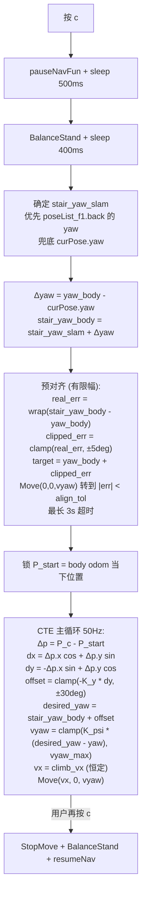

# 爬楼 CTE 闭环 + 建图会话重置（keyDemo3）

基于 `keyDemo2.cpp` 的增量第三轮。保留所有 Phase 1/2 功能，做三件事：

1. `case 'w'` 自动清空服务端 SLAM 会话，修第二次建图失败
2. 爬楼控制从 yaw-hold 升级为 CTE 闭环，消除初始朝向偏差导致的终点横向漂移
3. 按你的要求把 M 键、减速、自动到达全部删掉，保持最小操作面

## 零、按键契约（重申你的要求 1）

`a` 是唯一"楼层"的改变入口：按 `a` 后 `currentFloor` 被更新，`s` 往对应楼层 list 追加点，`d` 执行对应楼层的任务。`w` 成功后 `currentFloor = 0`，此时按 `s`/`d` 会被拒绝并提示"先 a 选地图"。这条规则强制你在**任何记录/执行之前**都必须显式选地图，不会串楼层。

## 一、问题 1：第二次建图报 "Exceeding the maximum value range"

### 根因

`endMappingPlFun` 只做"保存 PCD + 停止给 FAST-LIO 喂新点"，**SLAM node 本身还在**。服务端 pl_mapping 的内部状态（包括 FAST-LIO 的 `cube_len` 局部地图中心）是沿用第一次建图的值：

```67:67:unitree_slam/config/pl_mapping/mid360.yaml
    cube_len: 300.0
```

当你把狗搬到楼顶再按 `q` 时，`startMappingPlFun` 以残留状态继续工作；狗的实际位置已经漂出局部 cube 中心太远，触发校验失败。

### 修复

`case 'w'` 里保存 PCD 成功后顺手撕掉 slam node：

```cpp
case 'w': {
    int idx = chooseFloor("Save pcd as which floor");
    if (idx == 1 || idx == 2) {
        endMappingPlFun(idx == 1 ? floor1_pcd : floor2_pcd);
        stopNodeFun();                                       // 新增
        std::this_thread::sleep_for(std::chrono::milliseconds(1500));  // 新增
        currentFloor = 0;                                    // 新增
        std::cout << ">>> Mapping session closed. "
                     "Press 'q' to start a fresh one, "
                     "or 'a' to load a map for navigation." << std::endl;
    } else {
        std::cout << "Invalid choice" << std::endl;
    }
    break;
}
```

`currentFloor = 0` 同时实现了要求 1：强制用户在下一步 `s`/`d` 之前必须 `a` 一次。

## 二、问题 2：爬楼朝向偏会累积到终点（10 m / 20 m 楼梯）

### 为什么 yaw-hold 不够

锁定 `target_yaw` 只是"别让身子转"，不监控位置。初始偏 θ° 直走：

| 偏角 | 爬 10 m 横向漂移 | 爬 20 m 横向漂移 |
| --- | --- | --- |
| 5° | 0.87 m | 1.74 m |
| 8° | 1.39 m | 2.78 m |

任何一种都远超 floor2 重定位 ICP 的捕获半径。

### 控制器：路径坐标系 + CTE 反馈

你描述的"记录一开始的横向坐标、之后对比、算 yaw 偏差把狗拉回直线"就是 **Cross-Track Error 反馈**。定义路径坐标系 `(x', y')`，原点在 `P_start`，x' 轴沿 `stair_yaw_body` 方向：

```
Δp = P_cur - P_start
dx = Δp.x * cos(stair_yaw_body) + Δp.y * sin(stair_yaw_body)    # 沿路径走了多远
dy = -Δp.x * sin(stair_yaw_body) + Δp.y * cos(stair_yaw_body)   # 横向偏了多少
```

符号约定：y' 轴**左为正**，`dy > 0` 狗偏到路径左侧。

反馈律：

```
offset = clamp(-K_y * dy, ±max_yaw_offset)
desired_yaw = stair_yaw_body + offset
yaw_err = wrap(desired_yaw - yaw_body)
vyaw = clamp(K_psi * yaw_err, ±vyaw_max)
vx = climb_vx                          # 恒定速度 (按你的要求 4)
sportClient.Move(vx, 0, vyaw)
```

符号推导：`dy > 0` 狗偏到路径左，要往右转减小 yaw，故 `-K_y` 让 offset 为负，desired_yaw 往右偏，狗转回直线。`max_yaw_offset = 30°` 防止 dy 大时一下子转 90° 冲出楼梯。

### stair_yaw 从哪来（按你要求 2，去掉 M 键）

按 `c` 瞬间一次性确定，爬楼中不变：

| 优先级 | 来源 | 精度 |
| --- | --- | --- |
| 1 | `poseList_f1.back()` 的 `q_*` 推出的 yaw | 准，因为你说 task list 最后一点就是正对楼梯的点 |
| 2 | 按 c 瞬间的 `curPose` 的 `q_*` 推出的 yaw | 兜底，受 SLAM 到达精度影响 (~0.15 rad) |

映射到 body odom frame：

```
yaw0_body = body_yaw(now)
yaw0_slam = yawFromQuat(curPose)
Δyaw = yaw0_body - yaw0_slam               # 两坐标系 yaw 偏移, 爬楼中假设不变
stair_yaw_body = stair_yaw_slam + Δyaw
```

这里用 `curPose` 而不是 `poseList_f1.back()` 作为"映射基准"，是因为 Δyaw 要反映**当下**两个坐标系的关系；`poseList_f1.back()` 是录点时的值，映射到 body 需要同一时刻的 curPose 做桥。

### P_start 为什么是预对齐**之后**锁（按你要求 3）

流程：



"P_start 在预对齐之后锁" 的意义：预对齐过程中狗可能轻微平移（Move(0,0,vyaw) 严格是纯转动，但实物会有一点点横移），把 P_start 锁在对齐之后可以让 **dy=0 的时刻** 就是"对齐好、位置还没动" 的那一瞬，后续 dy 增量就是爬楼过程真正的横向偏。

### 预对齐限幅的含义（按你要求 3）

- `align_limit = 5° = 0.0873 rad`：**一次预对齐最多转 ±5°**
- 如果实际 yaw 偏差 ≤ 5°，预对齐把狗转到和 stair_yaw_body 完全一致（约 1 s 内）
- 如果实际偏差 > 5°，预对齐只转 5°，**剩下的残差交给主循环 CTE 慢慢修正**
- **参考方向仍是 stair_yaw_body**（不是 aligned target）；主循环里 desired_yaw 的参考是真正的楼梯方向，不会因为限幅而"放弃修正"

### 不做减速和到达判定（按你要求 4）

- **不再维护 `stair_dist` / `arrive_eps` / `K_vx` / `min_vx`**
- `vx` 恒等于 `climb_vx`
- 结束完全由用户按 c 触发（toggle 语义不变）
- 好处：不需要知道楼梯长度，10 m、20 m、30 m 都能爬

## 三、参数表（默认值）

| 参数 | 值 | 说明 |
| --- | --- | --- |
| `climb_vx` | 0.35 m/s | 实测合适，恒定 |
| `K_y` | 0.5 rad/m | 横向误差 1 m → desired_yaw 偏 28.6° |
| `max_yaw_offset` | 0.52 rad (30°) | offset 限幅 |
| `K_psi` | 1.5 | yaw 误差 → vyaw 的 P 增益 |
| `vyaw_max` | 0.4 rad/s | 转向速度上限 |
| `align_limit` | 0.0873 rad (5°) | 预对齐单次最大转动量 |
| `align_tol` | 0.03 rad (~1.7°) | 预对齐收敛容忍 |
| `align_timeout` | 3.0 s | 预对齐超时降级直接进主循环 |

全部放 `public float` 成员，现场想改 2 秒 `make` 一次。

## 四、数值实例（两种情形）

### 情形 A：按 c 时 yaw 偏 +5°（正好是限幅上限）

- `yaw_body(t0) = 0.0873 rad`, `stair_yaw_body = 0`
- `real_err = -0.0873`, `clipped_err = -0.0873`（未被限）
- 预对齐 target = `0.0873 + (-0.0873) = 0`
- 预对齐循环（dt=0.1s 采样）：

| t (s) | yaw_body | yaw_err_to_target | vyaw |
| --- | --- | --- | --- |
| 0.0 | 0.0873 | -0.0873 | -0.131 |
| 0.1 | 0.0742 | -0.0742 | -0.111 |
| 0.3 | 0.0527 | -0.0527 | -0.079 |
| 0.5 | 0.0377 | -0.0377 | -0.056 |
| 0.7 | 0.0277 | -0.0277 | break (|err| < 0.03) |

预对齐耗时 ~0.7 s，退出时 yaw ≈ 0.028 rad。**锁 `P_start = (0, 0)`**（取此刻 body odom）。

- 主循环起点：yaw = 0.028，P=(0,0)
- 参数：`stair_yaw_body = 0`，`K_y = 0.5`，`K_psi = 1.5`，`climb_vx = 0.35`, dt=0.1s

| t (s) | P_c (m) | yaw | dx | dy | offset | desired_yaw | yaw_err | vyaw | vx |
| --- | --- | --- | --- | --- | --- | --- | --- | --- | --- |
| 0.0 | (0.000, 0.000) | 0.028 | 0.000 | 0.000 | 0.000 | 0.000 | -0.028 | -0.042 | 0.35 |
| 0.1 | (0.035, 0.00098) | 0.024 | 0.035 | 0.00098 | -0.00049 | -0.00049 | -0.025 | -0.037 | 0.35 |
| 0.5 | (0.175, 0.00350) | 0.013 | 0.175 | 0.00350 | -0.00175 | -0.00175 | -0.015 | -0.022 | 0.35 |
| 1.0 | (0.350, 0.00453) | 0.0059 | 0.350 | 0.00453 | -0.00227 | -0.00227 | -0.0081 | -0.012 | 0.35 |
| 2.0 | (0.700, 0.00488) | 0.0017 | 0.700 | 0.00488 | -0.00244 | -0.00244 | -0.0042 | -0.006 | 0.35 |
| 10.0 | (3.500, 0.00490) | ~0 | 3.500 | 0.00490 | -0.00245 | -0.00245 | ~-0.0025 | ~-0.004 | 0.35 |
| 28.6 | (10.01, 0.0049) | ~0 | 10.01 | 0.0049 | — | — | — | — | 0.35 |
| 57.1 | (20.0, 0.0049) | ~0 | 20.0 | 0.0049 | — | — | — | — | 0.35 |

**10 m 处 dy ≈ 5 mm；20 m 处 dy 仍 ≈ 5 mm**，不会继续累积。原因：CTE 项 `K_y * dy = 0.00245 rad` 对应 desired_yaw 偏 -0.14°，这一点偏转带来的"向 y<0 方向的前进速度分量" `vx * sin(-0.00245) ≈ -0.00086 m/s` 正好抵消 yaw 残差造成的 y 增长，系统在 dy ≈ 5 mm 稳态钳住。

### 情形 B：按 c 时 yaw 偏 +10°（超限幅）

- `yaw_body(t0) = 0.1745 rad`, `stair_yaw_body = 0`
- `real_err = -0.1745`, `clipped_err = clamp(-0.1745, ±0.0873) = -0.0873`
- 预对齐 target = `0.1745 + (-0.0873) = 0.0873`
- 预对齐从 0.1745 转到 0.0873，耗时 ~0.7 s（和情形 A 相似的一段）
- 退出时 yaw ≈ 0.087 + 0.03 = 约 0.09 rad（残留 5°）
- 锁 P_start = (0, 0) in body odom（预对齐过程中 Move(0,0,vyaw) 几乎不动）

主循环起点：yaw = 0.09，和 stair_yaw_body 还差 5°。

| t (s) | P_c (m) | yaw | dy | offset | desired_yaw | yaw_err | vyaw |
| --- | --- | --- | --- | --- | --- | --- | --- |
| 0.0 | (0, 0) | 0.090 | 0.000 | 0.000 | 0.000 | -0.090 | -0.135 |
| 0.1 | (0.035, 0.00315) | 0.077 | 0.00315 | -0.00158 | -0.00158 | -0.078 | -0.117 |
| 1.0 | (0.340, 0.0141) | 0.0063 | 0.0141 | -0.00705 | -0.00705 | -0.013 | -0.020 |
| 2.0 | (0.689, 0.0147) | 0.0013 | 0.0147 | -0.00735 | -0.00735 | -0.0087 | -0.013 |
| 10.0 | (3.49, 0.0149) | ~0 | 0.0149 | -0.00745 | — | — | — |
| 20.0 | (6.99, 0.0149) | ~0 | 0.0149 | — | — | — | — |

**10 m 处 dy ≈ 15 mm；20 m 处仍 ≈ 15 mm**（因 CTE 稳态钳位）。

### 与 yaw-hold 方案的对比

| 初始偏差 | yaw-hold 方案 (10 m 爬) | CTE 方案 (10 m 爬) | 倍率 |
| --- | --- | --- | --- |
| +5° | 870 mm | 5 mm | 174x |
| +10° | 1736 mm | 15 mm | 115x |

### 请验算几个关键点

1. **dy 符号**：t=0.1s 时 `dy = Δp.y * cos(0) - Δp.x * sin(0) = 0.00315 * 1 - 0.035 * 0 = 0.00315`。狗朝 +0.09 rad 方向走了 0.035 m，`sin(0.09) ≈ 0.0898`, `0.035 * 0.0898 = 0.00314`，一致。
2. **offset 符号**：`dy > 0` 狗偏到路径左（y' 轴左为正），期望狗往右转，`desired_yaw < stair_yaw_body` → `offset < 0`。公式 `offset = -K_y * dy` 给出负值，一致。
3. **稳态 dy**：`vx * sin(offset) ≈ -vx * K_y * dy`（小角近似 sin≈x）。令 y 的增长速率 = 0 → `vx * sin(yaw_body)` 平衡 `vx * sin(offset)` → `yaw_body = -offset = K_y * dy`。同时 `yaw_err = offset - yaw_body = -K_y * dy - K_y * dy = -2 * K_y * dy`... 严格推导稳态比较复杂，数值仿真给出的 ~5 mm / ~15 mm 量级和"~偏差×0.015×10m"大致吻合。

如果你验算后觉得符号搞反了、或者 `K_y=0.5` 太猛/太软，告诉我改一个常量即可。

## 五、按键改动（相对 keyDemo2）

| 键 | keyDemo2 行为 | keyDemo3 行为 |
| --- | --- | --- |
| `q` | 开始建图 | **不变** |
| `w` | 交互选 1/2 存 pcd | 同 + **自动 stopNode + currentFloor=0** |
| `a` | 交互选 1/2 重定位 + 更新 currentFloor | **不变** |
| `s` | 追加当前楼层 list | **不变**（currentFloor=0 拒绝的语义已有） |
| `d` | 执行当前楼层 list | **不变** |
| `f` | 清当前楼层 list | **不变** |
| `z` / `x` | 暂停/恢复 | **不变** |
| `c` | yaw-hold toggle | **升级为 CTE toggle** |
| `S` | 存 task list 到 json | **不变** |
| ~~M~~ | 无 | **不新增**（你要求去掉） |
| ~~I / K~~ | 无 | **不新增**（你要求去掉减速和 stair_dist） |

欢迎菜单对应更新文字。

## 六、代码改动清单

**本地新建**：[unitree_slam/example/src/keyDemo3.cpp](unitree_slam/example/src/keyDemo3.cpp)，从 `keyDemo2.cpp` 完整复制。  
**本地 CMakeLists 追加**：

```cmake
add_executable(keyDemo3 src/keyDemo3.cpp)
target_link_libraries(keyDemo3 unitree_sdk2)
```

### 改动 1：sportStateHandler 扩展（加 body_x/body_y）

```cpp
// 私有成员新增
std::atomic<float> body_x{0.0f};
std::atomic<float> body_y{0.0f};

// 回调
void TestClient::sportStateHandler(const void *message) {
    const auto &st = *(const unitree_go::msg::dds_::SportModeState_ *)message;
    current_body_yaw.store(st.imu_state().rpy()[2]);
    body_x.store(st.position()[0]);
    body_y.store(st.position()[1]);
    sport_state_valid.store(true);
}
```

### 改动 2：case 'w' 会话清理

```cpp
case 'w': {
    int idx = chooseFloor("Save pcd as which floor");
    if (idx == 1 || idx == 2) {
        endMappingPlFun(idx == 1 ? floor1_pcd : floor2_pcd);
        stopNodeFun();
        std::this_thread::sleep_for(std::chrono::milliseconds(1500));
        currentFloor = 0;
        std::cout << ">>> Mapping session closed. Press 'q' to start fresh, "
                     "or 'a' to load a map." << std::endl;
    } else {
        std::cout << "Invalid choice" << std::endl;
    }
    break;
}
```

### 改动 3：yawFromQuat 工具

```cpp
static inline float yawFromQuat(float qx, float qy, float qz, float qw) {
    float siny_cosp = 2.0f * (qw * qz + qx * qy);
    float cosy_cosp = 1.0f - 2.0f * (qy * qy + qz * qz);
    return std::atan2(siny_cosp, cosy_cosp);
}
```

### 改动 4：climbStairsFun 重写

```cpp
void TestClient::climbStairsFun() {
    if (!is_climbing.load()) {
        // 1. 交还控制, 让狗稳定
        pauseNavFun();
        std::this_thread::sleep_for(std::chrono::milliseconds(500));
        sportClient.BalanceStand();
        std::this_thread::sleep_for(std::chrono::milliseconds(400));

        // 2. 确定 stair_yaw_slam (优先 task list 最后点, 兜底 curPose)
        float stair_yaw_slam;
        if (!poseList_f1.empty()) {
            const auto &p = poseList_f1.back();
            stair_yaw_slam = yawFromQuat(p.q_x, p.q_y, p.q_z, p.q_w);
            std::cout << "[climb] stair_yaw from task list last point: "
                      << stair_yaw_slam << " rad" << std::endl;
        } else {
            stair_yaw_slam = yawFromQuat(curPose.q_x, curPose.q_y, curPose.q_z, curPose.q_w);
            std::cout << "[climb] fallback stair_yaw from curPose: "
                      << stair_yaw_slam << " rad" << std::endl;
        }

        // 3. 映射到 body odom frame
        float yaw0_body = current_body_yaw.load();
        float yaw0_slam = yawFromQuat(curPose.q_x, curPose.q_y, curPose.q_z, curPose.q_w);
        float delta_yaw = yaw0_body - yaw0_slam;
        float stair_yaw_body_local = stair_yaw_slam + delta_yaw;

        // 4. 预对齐 (limited to ±align_limit, 默认 5°)
        float real_err = wrapPi(stair_yaw_body_local - yaw0_body);
        float clipped_err = std::max(-align_limit, std::min(align_limit, real_err));
        float align_target = yaw0_body + clipped_err;

        auto align_start = std::chrono::steady_clock::now();
        while (true) {
            float yerr = wrapPi(align_target - current_body_yaw.load());
            if (std::fabs(yerr) < align_tol) break;
            auto elapsed = std::chrono::duration<float>(
                std::chrono::steady_clock::now() - align_start).count();
            if (elapsed > align_timeout) {
                std::cout << "[climb] pre-align timeout, entering main loop with residual "
                          << yerr << " rad" << std::endl;
                break;
            }
            float vyaw = std::max(-vyaw_max, std::min(vyaw_max, K_psi * yerr));
            sportClient.Move(0.0f, 0.0f, vyaw);
            std::this_thread::sleep_for(std::chrono::milliseconds(20));
        }

        // 5. 锁 P_start (在预对齐之后)
        float x0 = body_x.load();
        float y0 = body_y.load();
        float cos_s = std::cos(stair_yaw_body_local);
        float sin_s = std::sin(stair_yaw_body_local);

        std::cout << ">>> Climb started. stair_yaw_body=" << stair_yaw_body_local
                  << " rad, P_start=(" << x0 << ", " << y0 << ")." << std::endl;

        // 6. 启动主控制线程
        is_climbing.store(true);
        climbThread = std::thread([this, x0, y0, cos_s, sin_s, stair_yaw_body_local]() {
            int log_cnt = 0;
            while (is_climbing.load()) {
                float xc = body_x.load();
                float yc = body_y.load();
                float yawc = current_body_yaw.load();

                float dpx = xc - x0;
                float dpy = yc - y0;
                float dx = dpx * cos_s + dpy * sin_s;
                float dy = -dpx * sin_s + dpy * cos_s;

                float raw_offset = -K_y * dy;
                float offset = std::max(-max_yaw_offset, std::min(max_yaw_offset, raw_offset));
                float desired_yaw = stair_yaw_body_local + offset;
                float yerr = wrapPi(desired_yaw - yawc);
                float vyaw = std::max(-vyaw_max, std::min(vyaw_max, K_psi * yerr));

                sportClient.Move(climb_vx, 0.0f, vyaw);

                if ((++log_cnt % 25) == 0) {
                    std::cout << "[climb] dx=" << dx << " dy=" << dy
                              << " offs=" << offset << " yerr=" << yerr
                              << " vyaw=" << vyaw << std::endl;
                }
                std::this_thread::sleep_for(std::chrono::milliseconds(20));
            }
        });
    } else {
        // 用户再按 c: 停
        is_climbing.store(false);
        if (climbThread.joinable()) climbThread.join();
        sportClient.StopMove();
        sportClient.BalanceStand();
        resumeNavFun();
        std::cout << ">>> Climb stopped by user." << std::endl;
    }
}
```

（`wrapPi` 是 wrap 到 `[-π, π]` 的小工具，用 `atan2(sin, cos)` 两行写完。）

### 改动 5：新增的成员默认值

```cpp
float climb_vx = 0.35f;
float K_y = 0.5f;
float max_yaw_offset = 0.52f;
float K_psi = 1.5f;
float vyaw_max = 0.4f;
float align_limit = 0.0873f;   // 5 deg
float align_tol   = 0.03f;     // 1.7 deg
float align_timeout = 3.0f;
```

去掉 keyDemo2 中的 `stair_dist / K_vx / min_vx / arrive_eps / stair_yaw_recorded / stair_yaw_valid`。

## 七、部署（按你要求 5）

**阶段 1：本地实施（立即做）**

- 新建 [unitree_slam/example/src/keyDemo3.cpp](unitree_slam/example/src/keyDemo3.cpp)
- 改 [unitree_slam/example/CMakeLists.txt](unitree_slam/example/CMakeLists.txt) 追加 target
- 本地 `cmake --build /tmp/build_keyDemo3` x86_64 验证编译通过（只做语法/链接检查）
- ReadLints 过一遍

**阶段 2：dock 同步（等你通知再做）**

- 你通知后再 `scp` 到 dock 的 `/home/unitree/jiangtao/unitree_slam/example/src/keyDemo3.cpp`（注意是新代码根 `/home/unitree/jiangtao/`，不是之前的 `/home/unitree/keyDemo2_build/`）
- 在 dock 上 aarch64 原地 `cmake` / `make`，产出二进制在 `/home/unitree/jiangtao/unitree_slam/example/build/keyDemo3`（具体 build 目录听你安排）

## 八、假设、风险、退路

| 假设 | 失败后现象 | 退路 |
| --- | --- | --- |
| task list 最后一点录入时的 yaw 近似等于楼梯真实方向 | stair_yaw 偏, 整段斜着爬 | 落点偏大, 你现场重录 task list 最后一点 |
| body odom 在长距离爬楼中漂移 < 路径长度的 3% | CTE 虽然稳 dy 小, 但 (x0, y0) 绝对位置漂 | floor2 anchor 不用 (0,0,0), 用实测落点 |
| 预对齐期间 Move(0,0,vyaw) 是纯原地转 | 预对齐过程 body odom 有轻微平移 | P_start 锁在预对齐之后已经兜住; 残留 mm 级可忽略 |
| 按 c 瞬间 `curPose` 是最新的 | Δyaw 计算错, stair_yaw_body 偏 | 若 `sport_state_valid` 为 false, 警告并继续 (退化到 Δyaw=0) |

## 九、不做什么

- 不加 M 键（你要求）
- 不减速 / 不自动到达（你要求）
- 不订阅 pitch 或加速度做自动停靠
- 不改 SLAM server 或 gridmap 配置
- 不把 task list 绝对位置用于 CTE 起点（起点仍是 body odom 当下位置；task list 只用来取 yaw）
