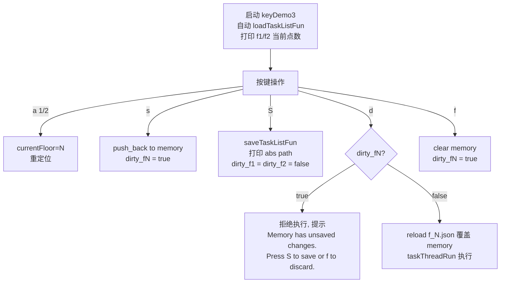

# keyDemo3：显式 S 保存 + d 前 reload + 终端 tee 日志

## 一、最终工作流



核心契约：

- `s` 只进内存、置 dirty
- `f` 清内存、置 dirty（因为内存和磁盘不一致了）
- `S` 是唯一写盘动作，清 dirty、打印绝对路径
- `d` 看 dirty；false 就先 reload 磁盘覆盖内存再执行，true 就拒绝
- 启动仍自动 `loadTaskListFun()`，打印初始点数让你看到快照

## 二、具体改动清单

全部在 [unitree_slam/example/src/keyDemo3.cpp](unitree_slam/example/src/keyDemo3.cpp) 一个文件，CMakeLists 不动。

### 改动 1：顶部 include 追加

```cpp
#include <filesystem>
#include <streambuf>
#include <ctime>
```

### 改动 2：加 TeeBuf 类 + main 里启动 tee log

`using namespace` 前插入：

```cpp
class TeeBuf : public std::streambuf {
public:
    TeeBuf(std::streambuf *a, std::streambuf *b) : a_(a), b_(b) {}
protected:
    int overflow(int c) override {
        if (c == EOF) return !EOF;
        int r1 = a_->sputc(static_cast<char>(c));
        int r2 = b_->sputc(static_cast<char>(c));
        return (r1 == EOF || r2 == EOF) ? EOF : c;
    }
    int sync() override {
        int r1 = a_->pubsync();
        int r2 = b_->pubsync();
        return (r1 == 0 && r2 == 0) ? 0 : -1;
    }
private:
    std::streambuf *a_, *b_;
};
```

`main()` 在 `ChannelFactory::Instance()->Init` 之前加：

```cpp
std::time_t now_t = std::time(nullptr);
std::tm tm_info;
localtime_r(&now_t, &tm_info);
char logname[96];
std::strftime(logname, sizeof(logname), "keyDemo3_%Y%m%d_%H%M%S.log", &tm_info);
std::ofstream logFile(logname);
TeeBuf tee(std::cout.rdbuf(), logFile.rdbuf());
if (logFile.is_open()) {
    std::cout.rdbuf(&tee);
    std::cout << "=== keyDemo3 started, log: "
              << std::filesystem::absolute(logname).string() << " ===" << std::endl;
}
```

log 文件落 cwd，也就是 `/home/unitree/jiangtao/unitree_slam/example/build/keyDemo3_<ts>.log`。ANSI 颜色序列原样写入，`less -R log` 能正常显色。

### 改动 3：dirty 标志成员

private 区加：

```cpp
bool poseList_f1_dirty = false;
bool poseList_f2_dirty = false;
```

启动 load 之后 dirty 保持 false —— 此时内存 = 磁盘。

### 改动 4：S 键打印绝对路径 + 清 dirty

重写 `saveTaskListFun()`：

```cpp
void TestClient::saveTaskListFun()
{
    auto dumpList = [](const std::vector<poseDate> &list, const std::string &path) -> bool {
        nlohmann::json arr = nlohmann::json::array();
        for (const auto &p : list) {
            nlohmann::json j;
            j["x"] = p.x; j["y"] = p.y; j["z"] = p.z;
            j["q_x"] = p.q_x; j["q_y"] = p.q_y;
            j["q_z"] = p.q_z; j["q_w"] = p.q_w;
            j["mode"] = p.mode; j["speed"] = p.speed;
            arr.push_back(j);
        }
        std::ofstream f(path);           // trunc 默认模式, 自动覆盖
        if (!f.is_open()) return false;
        f << arr.dump(2);
        return true;
    };

    bool ok1 = dumpList(poseList_f1, taskListPath_f1);
    bool ok2 = dumpList(poseList_f2, taskListPath_f2);
    std::string abs1 = std::filesystem::absolute(taskListPath_f1).string();
    std::string abs2 = std::filesystem::absolute(taskListPath_f2).string();

    std::cout << "[S] floor1 (" << poseList_f1.size() << " pts) -> "
              << abs1 << (ok1 ? " [OK]" : " [FAIL]") << std::endl;
    std::cout << "[S] floor2 (" << poseList_f2.size() << " pts) -> "
              << abs2 << (ok2 ? " [OK]" : " [FAIL]") << std::endl;

    if (ok1) poseList_f1_dirty = false;
    if (ok2) poseList_f2_dirty = false;
}
```

### 改动 5：s / f 置 dirty

`case 's'` 末尾：

```cpp
(currentFloor == 1 ? poseList_f1_dirty : poseList_f2_dirty) = true;
```

`case 'f'`：

```cpp
if (currentFloor == 0) {
    poseList_f1.clear();
    poseList_f2.clear();
    poseList_f1_dirty = true;
    poseList_f2_dirty = true;
} else {
    auto &list = (currentFloor == 1) ? poseList_f1 : poseList_f2;
    list.clear();
    (currentFloor == 1 ? poseList_f1_dirty : poseList_f2_dirty) = true;
}
```

### 改动 6：新增 `loadFloorListFromDisk(int)`

在 `loadTaskListFun` 附近加：

```cpp
int TestClient::loadFloorListFromDisk(int floor)
{
    if (floor != 1 && floor != 2) return -3;
    const std::string &path = (floor == 1) ? taskListPath_f1 : taskListPath_f2;
    std::vector<poseDate> &list = (floor == 1) ? poseList_f1 : poseList_f2;

    std::ifstream f(path);
    if (!f.is_open()) return -1;
    nlohmann::json arr;
    try { f >> arr; } catch (...) { return -2; }
    if (!arr.is_array()) return -2;

    list.clear();
    for (const auto &j : arr) {
        poseDate p;
        p.x = j.value("x", 0.0f); p.y = j.value("y", 0.0f); p.z = j.value("z", 0.0f);
        p.q_x = j.value("q_x", 0.0f); p.q_y = j.value("q_y", 0.0f);
        p.q_z = j.value("q_z", 0.0f); p.q_w = j.value("q_w", 1.0f);
        p.mode = j.value("mode", 1); p.speed = j.value("speed", 0.8f);
        list.push_back(p);
    }
    (floor == 1 ? poseList_f1_dirty : poseList_f2_dirty) = false;
    return static_cast<int>(list.size());
}
```

把 `loadTaskListFun()` 里的重复循环也改成调用 `loadFloorListFromDisk(1)` 和 `loadFloorListFromDisk(2)` 两次，保持向下兼容。

### 改动 7：d 键 "dirty 拒绝 / 不 dirty 就 reload + 执行"

```cpp
case 'd':
{
    if (currentFloor == 0) {
        std::cout << "No map loaded; press 'a' first to pick a floor." << std::endl;
        break;
    }
    bool dirty = (currentFloor == 1) ? poseList_f1_dirty : poseList_f2_dirty;
    int memSize = (int)((currentFloor == 1) ? poseList_f1.size() : poseList_f2.size());
    if (dirty) {
        std::cout << "\033[1;31m"
                  << "[d] Floor " << currentFloor << " has UNSAVED changes in memory ("
                  << memSize << " pts). Press 'S' to save first, or 'f' to discard."
                  << "\033[0m" << std::endl;
        break;
    }
    int n = loadFloorListFromDisk(currentFloor);
    if (n < 0) {
        std::cout << "[d] Failed to reload f" << currentFloor
                  << ".json (code=" << n << "). Aborting." << std::endl;
        break;
    }
    std::cout << "[d] Reloaded floor " << currentFloor
              << " (" << n << " pts) from disk, starting navigation..." << std::endl;
    taskThreadRun();
    break;
}
```

### 改动 8：菜单文字同步

把 s / S / d 三行改成：

```
------------------ s: push pose to memory (dirty)------------------
------------------ S: SAVE memory -> json (abs)  -----------------
------------------ d: reload + execute (SAVE 1st)-----------------
```

## 三、Bug 2 的兜底：清一次历史残留

改完代码后，**第一次跑之前**把 dock 上旧 json 清掉，避免启动 load 再次拿回残留：

```bash
ssh unitree@192.168.8.3 'cd /home/unitree/jiangtao/unitree_slam/example/build && ls -la *.json 2>/dev/null; rm -f f1.json f2.json; echo cleaned'
```

此后标准流程：

1. 启动 keyDemo3 → 看到 "No floor1/2 task list found"，初始干净
2. `a → 1` / 录路径 / `s × N` / `S`（看到 abs 路径）/ `d`（reload + 执行）
3. `w` 存 pcd（会自动 stopNode + currentFloor=0）
4. `a → 2` / `s × M` / `S` / `d`

## 四、部署步骤

1. 本地 StrReplace 改 keyDemo3.cpp
2. ReadLints 检查
3. 本地 `cmake --build /tmp/build_keyDemo3 --target keyDemo3` x86_64 验证
4. scp 到 dock `/home/unitree/jiangtao/unitree_slam/example/src/`
5. dock `cd .../example/build && make keyDemo3` aarch64 增量编译
6. dock `rm -f f1.json f2.json` 清残留
7. 告诉你可以跑

## 五、不做什么

- 不去掉大写 S（它是**唯一**写盘动作）
- 不把 s 改成自动落盘（保留你的显式模型）
- 不给 cerr 加 tee（keyDemo3 几乎不用 cerr）
- 不过滤 log 里的 ANSI 颜色（`less -R` 正常显示）
- 不改 `climbStairsFun`（CTE 控制一字不动）
- 不改 `case 'w'`（stopNode + currentFloor=0 已就绪）